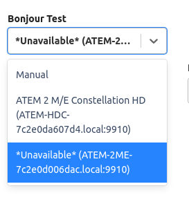

Bonjour is a standardised method of device discovery, utilising MDNS.

Starting with [API 1.7](../api-changes/v1.7.md) (Companion 3.2), Companion allows you to easily discover devices using the Bonjour protocol, thus helping users with configuration.

## Setting up Bonjour

You can do this by defining a config field such as:

```js
{
	type: 'bonjour-device',
	id: 'bonjour_host',
	label: 'Bonjour Test',
	width: 6,
},
```

and in your `companion/manifest.json`:

```js
	"bonjourQueries": {
		"bonjour_host": {
			"type": "blackmagic",
			"protocol": "tcp",
			"txt": {
				"class": "AtemSwitcher"
			}
		}
	}
```

These two structures are linked by the common id, in the future this will allow us to automate device discovery further.

In the UI, this field will look like:  


The 'Manual' option is always shown, and must be handled to allow users to manually specify an address for environments where Bonjour does not work.  
This can be achieved with further config fields such as:

```js
{
	type: 'textinput',
	id: 'host',
	label: 'Target IP',
	isVisibleExpression: `!$(options:bonjour_host)`,
	default: '',
	regex: Regex.IP,
},
```

Note the presence of the `isVisibleExpression`, to control the visibility of the fields depending on whether a bonjour discovered device has been selected.

In your module code, the `bonjour_host` will have a value such as `10.0.0.1:8000` or null.

### Writing your Bonjour Query

We currently support a subset of the possible query options. In all queries, the `type` and `protocol` must be set.  
If your device needs further filtering, this can be done by specifying any `txt` field values the entries must have.

Since [API 1.10](../api-changes/v1.10.md) each entry in the manifest under `bonjourQueries` in the manifest can be an array, to allow you to run multiple queries in parallel. This can be useful when supporting multiple models which use slightly different queries

Since [API 1.12](../api-changes/v1.12.md) it is possible to filter by `port` number in the query. It is recommended to only use this as a last resort, as port numbers are often configurable.

Since [API 2.0](../api-changes/v2.0.md) it is possible to specify an `addressFamily` for the query. This allows you to specify whether `ipv4`, `ipv6` or both (`ipv4+6`) addresses are returned by the query.

## Further Reading

- [User Config](../connection-basics/user-configuration.md)
- [Autogenerated docs for the module `InstanceBase` class](https://bitfocus.github.io/companion-module-base/classes/InstanceBase.html)
