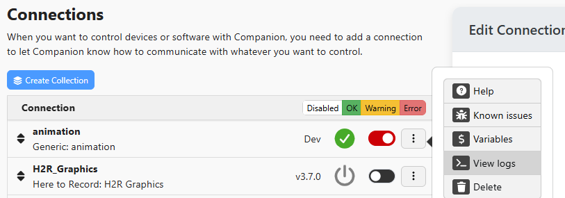

:::danger

This guide was written over 3 years ago for an earlier version of the module api.
A majority of it will translate, but it will not be perfect match. You may want to follow this to update to the API 1.x format, then follow the newer upgrade docs for updating to the latest structure.

:::

## Background

In Companion 3.0, we rewrote the module-api from scratch. We chose to do this because the old api had grown very organically over 5 years, and was starting to show various issues. The main issues was modules were running in the main companion thread, and method signatures were assuming various calls to be synchronous, and modules being able to access various internals of companion (and some making concerningly large use of that ability).  
Rather than trying to quickly fix up the api, it was decided to rethink it entirely.

The general shape of the api should be familiar, but many methods names have been changed, and the whole api is written to rely on promises a lot more when before either callbacks were abused or methods would be synchronous.

Technology has also evolved since many of the modules were written, with many of them using js syntax that was superseded in 2015! As part of this overhaul, we have imposed some minimum requirements for tooling and code style. This shouldnt be an issue, but if you run into any issues let us know on slack and we will help you out.

Note: This guide is written assuming your module is an ES6 class (`class YourModule extends InstanceSkel {`). If it is not, then it would be best to convert it to that format first, to simplify this process. That can be done before starting this conversion for Companion 3.0, as it is supported in all older versions of companion

## First steps

You no longer need a developer version of companion to develop your module! It can now be done with the version you usually run, or you can keep to the old way if you prefer, but you shall have to refer to the main application development guides for getting that setup and running again.

Once you have the companion launcher open, click the cog in the top right. This will reveal a 'Developer modules path' field. Use this to select a `companion-module-dev` folder you created containing your modules code. See the page on [Setting up the Development Folder](../local-modules.md)

Companion will load in any modules it finds from that folder when starting, and will restart itself whenever a file inside that folder is changed.

You can now clone or move or existing clone into the folder you specified for development modules. Once you have done this, launch companion and it will report your module as crashing in its status, as your code needs updating.

While developing, you can view a log for an instance in the ui. This will show all messages written with `this.log()`, `this.updateStatus()` and anything written to the console. Some of this is omitted from other logs, this is the best place to see output from your module while it is running.



### 1) Add new dependencies

To help with this new flow, any files you previously imported from companion itself (eg '../../../instance_skel') have been rewritten and are now located in a dedicated npm package. And there is a second package which provides some tooling to help with packaging your module for distribution.

You can add these to your module by running `yarn add @companion-module/base -T` and `yarn add --dev @companion-module/tools`

Note: We recommend `@companion-module/base` to be installed as `~1.4` rather than `^1.4.1` as the version of this will dictate the versions of companion your module is compatible with. Read the documentation on module versioning if you want more details.

Add a new file (if not exist already) : `.yarnrc.yml` and put the following code in:

```
nodeLinker: node-modules
```

You should also add the following to your `.gitignore` file:

```
/pkg
/pkg.tgz
```

### 2) Create the companion manifest

Previously, Companion would read some special properties from your package.json file to know about your module. We have decided that we should instead be using our own file, so that we can avoid properties we do not need, and reduce ambiguation in the contents. This will also allow us to handle modules which are not node/npm based.

To start, run the command `yarn companion-generate-manifest`. This will generate the `companion` folder based on your package.json.

As part of the process, you should notice that the `HELP.md` file has moved into the folder too. The `HELP.md` is also expected to be inside of this folder, as well as any images it uses.

Please give the manifest a read, it should be fairly self explanatory. You should verify that the `runtime.entrypoint` property is a relative path to your main javascript file. It should have been generated correctly, but be aware that you will need to change this if you move/rename the file it references.

### 3) package.json cleanup

Now that you have the new manifest, you can cleanup the old properties from your package.json.

The following properties can be removed:

- api_version
- keywords
- legacy
- manufacturer
- product
- shortname
- description
- bugs
- homepage
- author
- contributors

Note: some of these are standard npm properties, but they are no longer necessary and are defined in the manifest.json

If you have a `postinstall` script defined to build your module, that should now be removed.

If you are using typescript, you can move any `@types/*` packages from dependencies to devDependencies, but this is not required. The build script should be changed from `npx rimraf dist && npx typescript@~4.5 -p tsconfig.build.json` to `rimraf dist && yarn build:main`.

As this is quite a large change, we should update the version number too. To make the size of the change here clear, we should increment the first number in the version. For example, `1.5.11` should become `2.0.0` or `3.0.1` should become `4.0.0`. This classes it as a breaking change. Make sure to change the number in package.json, as that is the master location for that. Refer to the [Versioning of Modules guide](../../git-workflows/versioning.md#version-of-modules) for details.

### 4) Prepare to update your code

You are now ready to begin updating your code. Many properties and methods have been renamed, so this can take some time in larger modules. But the hope is that it provides a much more consistent and easier to understand api than before.

Because of the amount of changes, we recommend following our steps for what to do, then to test and debug it at the very end. If you attempt to run it part way through it will most likely produce weird errors or constantly crash.

Before we begin, it is recommended that you ensure you have some understanding of async & Promises in nodejs. Previously the api was very synchronous, due to everything sharing a single thread, but some methods are now asynchronous as each instance of your module is run in its own thread. It is important to understand how to use promises, as you will need that to get any values from companion, and any promises left 'floating' will crash your module.

TODO - write more about async or find some good tutorials/docs/examples

If you are ever unsure on how something should look, we recommend looking at the following modules. This is a curated list of up-to-date and well maintained modules. If you are still unsure, then reach out in #module-development in slack.

- [generic-osc](https://github.com/bitfocus/companion-module-generic-osc)
- [homeassistant-server](https://github.com/bitfocus/companion-module-homeassistant-server)

Advanced users: You are now able to make your module be ESM if you wish. It is completely optional and should require no special configuration for companion.

Finally, look through your code and make sure that any dependencies you use are defined in your `package.json`. Many modules have been accidentally using the dependencies that companion defined, but in this new structure that is not possible. You may need to spend some time updating your code to work with the latest version of a library, but this is a good idea to do every now and then anyway.

### 5) Update your actions

If you are using typescript, `CompanionAction` and `CompanionActions` have been renamed to `CompanionActionDefinition` and `CompanionActionDefinitions` and should be imported from `'@companion-module/base'`.

For the action definitions, the following changes have been made:

- `label` has been renamed to `name`
- `options` is required, but can be an empty array (`[]`)
- `callback` is now required. This is the only way an action can be executed (more help is below)

Tip: While you are making these changes, does the value of `name` still make sense? Perhaps you could set a `description` for the action too?

Some changes to `options` may be required, but we shall cover those in a later step, as the same changes will need to be done for feedbacks and config_fields.

If you aren't already aware, there are some other properties you can implement if you need then.
You can find the typescript definitions as well as descriptions of each property you can set [in the module-base repo](https://github.com/bitfocus/companion-module-base/blob/main/src/module-api/action.ts). Do let us know if anything needs more explanation/clarification.

The `callback` property is the only way for an action to be executed. In previous versions it was possible to do this by implementing the `action()` function in the main class too. We found that using this callback made modules more maintainable as everything for an action was better grouped together, especially when the other methods are implemented.
If you need help figuring out how to convert your code from the old `action` method to these callbacks then reach out on slack.

The parameters supplied to the `callback` or `action` function have been restructured too:

- The second parameter has been merged into the first, with some utility methods provided in the second parameter.
- `action` has been renamed to `actionId` to be more consistent with elsewhere. This is the `id` you gave your actionDefinition.
- `deviceId` is no longer provided as we don't see a use case for why this is useful. Let us know if you have one and we shall consider re-adding it
- `bank` and `page` are no longer provided. These have been replaced by `controlId`. Actions can reside in a trigger rather than on a bank, and controlId lets us express that better. `controlId` is a unique identifier that will be the same for all actions & feedbacks on the same button or inside the same trigger, but its value should not be treated as meaningful. In a later version of companion the value of the `controlId` will change.
- The new second parameter contains an implementation of `parseVariablesInString`, this has more purpose for feedbacks, and is provided to actions for consistency

Note: there are some properties on the object with names starting with an underscore that are not mentioned here. You must not use these, as these are temporary properties. They will be removed without notice in a future version.

If you are using `subscribe`, `unsubscribe` or `learn`, the object parameter has changed a little, and is a subset of the properties supplied to `callback`.

Finally, to pass the action definitions to companion has changed. It is now `this.setActionDefinitions(actions)` instead of `this.setActions(actions)` or `self.system.emit('instance_actions', self.id, actions)`

### 6) Updating your feedbacks

If you are using typescript, `CompanionFeedback` and `CompanionFeedbacks` have been renamed to `CompanionFeedbackDefinition` and `CompanionFeedbackDefinitions` and should be imported from `'@companion-module/base'`.

For the feedback definitions, the following changes have been made:

- `type` is now required. If you don't have it set already, then it should be set to `'advanced'`
- `label` has been renamed to `name`
- `options` is required, but can be an empty array (`[]`)
- `callback` is now required. This is the only way an action can be executed (more help is below)
- If your feedback is of `type: 'boolean'` then `style` has been renamed to `defaultStyle`

Additionally, the `rgb` and `rgbRev` methods no longer exist on your instance class. They have been renamed to `combineRgb` and `splitRgb` and should be imported from `'@companion-module/base'`.

Tip: While you are making these changes, does the value of `name` still make sense? Perhaps you could set a `description` for the action too?

Some changes to `options` may be required, but we shall cover those in a later step, as the same changes will need to be done for feedbacks and config_fields.

If you aren't already aware, there are some other properties you can implement if you need then.
You can find the typescript definitions as well as descriptions of each property you can set [in the module-base repo](https://github.com/bitfocus/companion-module-base/blob/main/src/module-api/feedback.ts). Do let us know if anything needs more explanation/clarification.

The `callback` property is the only way for an feedback to be checked. In previous versions it was possible to do this by implementing the `feedback()` function in the main class too. We found that using this callback made modules more maintainable as everything for a feedback was better grouped together, especially when the other methods are implemented.
If you need help figuring out how to convert your code from the old `feedback` method to these callbacks then reach out on slack.

The parameters supplied to the `callback` or `feedback` function have been restructured too:

- The parameters have been merged into one, with some utility methods provided in the second parameter.
- `type` has been renamed to `feedbackId` to be more consistent with elsewhere. This is the `id` you gave your feedbackDefinition.
- `bank` and `page` are no longer provided. These have been replaced by `controlId`. Feedbacks can reside in a trigger rather than on a bank, and controlId lets us express that better. `controlId` is a unique identifier that will be the same for all actions & feedbacks on the same button or inside the same trigger, but its value should not be treated as meaningful. In a later version of companion the value of the `controlId` will change.
- It is no longer possible to get the complete 'bank' object that was provided before. Do let us know if you have a use case for it, we couldn't think of one.
- For 'advanced' feedbacks, the `width` and `height` properties are now represented by a single `image` property. This helps clarify when they will be defined. Also note that these may not be present for all feedbacks in a future version.
- The new second parameter contains an implementation of `parseVariablesInString`. You **must** use this instead of the similar method on the class, otherwise your feedback will not be rechecked when the variables change.

Note: there are some properties on the object with names starting with an underscore that are not mentioned here. You must not use these, as these are temporary properties. They will be removed without notice in a future version.

If you are using `subscribe`, `unsubscribe` or `learn`, the object parameter has changed a little, and is a subset of the properties supplied to `callback`.

### 7) Updating your presets

If you are using typescript, `CompanionPreset` has been renamed to `CompanionButtonPresetDefinition`. There is also a `CompanionPresetDefinitions` defining a collection of these objects.

The first change to be aware of, is that the `setPresetDefinitions()` function is now expecting an object of presets, rather than array. This is for better consistency with actions and feedbacks, and also provides a unique id for each preset.

For the preset definitions, the following changes have been made for both types:

- `type` is a new property that must be `button`
- `label` has been renamed to `name`
- `options` is a new property of some behavioural properties for the button. Its contents is explained below.
- `bank` has been renamed to `style`. Additionally some properties have been moved out of this object, listed below.
- `bank.style` has been removed
- `bank.relative_delay` has been moved to `options.relativeDelay`
- `bank.latch` has been removed. This will be handled below when changing the actions
- `feedbacks` The objects inside this have changed slightly. The `type` property has been renamed to `feedbackId`, for better consistency.
- `actions` and `release_actions` have been combined into `steps`, the exact structure is documented below.

Note: Even when there are no actions or feedbacks, you would need to put those objects in : `feedbacks: []` & `steps: []`.

Note: Remember that the `rgb` and `rgbRev` methods no longer exist on your instance class. They have been renamed to `combineRgb` and `splitRgb` and should be imported from `'@companion-module/base'`.

The latch button mode has been replaced with a more flexible 'stepped' system. On each button, you can have as many steps as you wish, each with their own down/up/rotate actions. When releasing the button, it will by default automatically progress to the next step, or you can disable that and use an internal action to change the current step of a button.  
While is is wordier and more complex to make a latched button, this allows for much more complex flows, such as using another button as a 'shift' key, or having one 'go' button which runs the whole pre-programmed show.

The `steps` property is an array of objects. Each object should be at a minimum `{ down: [], up: [] }` (`rotate_left` and `rotate_right` are also valid here).

For example, a normal button will only have one step:

```javascript
steps: [
  {
    down: [],
    up: [],
  },
]
```

Or you can match the old latching behaviour with:

```javascript
steps: [
  {
    // Put the 'latch' actions here
    down: [],
    up: [],
  },
  {
    // Put the 'unlatch' actions here
    down: [],
    up: [],
  },
]
```

For the action objects inside of each of these steps, the `action` property renamed to `actionId`, for better consistency with elsewhere.

### 8) Updating options and config fields

The options/input fields available to use as options for actions and feedbacks, as well as for your config fields has changed a little.

There may be additional new properties not listed here. You can check [the docs](../connection-basics/input-field-types.md) for full details on the available input fields.

#### common changes

The optional `isVisible` function has changed, its parameter is now the options object for the action/feedback, not the whole action/feedback object

#### text

The `text` type has been renamed to `static-text`

#### textinput & textwithvariables

These have been combined into one `textinput`. With a new `useVariables` property to select the mode.

#### dropdown

This has been split into `dropdown` and `multidropdown`.

`minSelection` and `maximumSelectionLength` are only valid for `multidropdown`

`maximumSelectionLength` has been renamed to `maxSelection`

`regex` and `allowCustom` are only valid for `dropdown`

#### multiselect

`multidropdown` should be used instead

#### checkbox & colorpicker & number

These are unchanged

#### Anything else

That should be all of them, if you have something else then it has likely been forgotten/removed.

Either use a supported input type or let us know what we missed.

### 9) Updating variables

If you are using typescript, `CompanionVariable` has been renamed to `CompanionVariableDefinition` and should be imported from `'@companion-module/base'`.

For the variable definitions, the following changes have been made:

- `name` has been renamed to `variableId`
- `label` has been renamed to `name`

We acknowledge that this change is rather confusing, but it felt necessary for consistency with elsewhere

To set the value of variables, the `setVariables` method has been renamed to `setVariableValues`, and the `setVariable` method has been removed.
This is to encourage multiple values to be set in the one call which will make companion more responsive by being able to process multiple changes at a time. Please try to combine calls to `setVariableValues` where possible.

For example, before:

```js
this.setVariable('one', 'word')
this.setVariable('two', 34)
this.setVariable('three, undefined)
```

After:

```js
this.setVariableValues({
  one: 'word',
  two: 34,
  three: undefined,
})
```

### 10) Updating upgrade-scripts

If you are using typescript, `CompanionStaticUpgradeScript` should be imported from `'@companion-module/base'`.

If you are using the `CreateConvertToBooleanFeedbackUpgradeScript` helper method on the InstanceSkel, this has moved and should be imported from `'@companion-module/base'`.

The upgrade script parameters and return value have been completely reworked, as the old functions did not fit into the new flow well.

The first parameter (`context`) to the functions remains, but currently has no methods. We expect to add some methods in the future.
The remaining parameters have been combined into a single `props` object.

This object is composed as

```js
{
    config: Object | null,
    actions: [],
    feedbacks: [],
}
```

Tip: These upgrade scripts can be called at any time. They can be called to upgrade existing configuration, or when data is imported into companion.

At times the config property will be null, if the config does not need updating. There may be no actions or no feedbacks, depending on what needs upgrading.

Previously, the return type was simply `boolean`, to state whether anything had changed. The return type is now expected to be an object of the format:

```js
{
    updatedConfig: Object | null,
    updatedActions: [],
    updatedFeedbacks: [],
}
```

If an action or feedback is not included in the output type, then it is assumed to not have been changed and any changes you have made to the object passed in will be lost.
If `updatedConfig` is not set, then it is assumed that the config has not changed, and any changes will be lost.

This allows companion to better understand what has changed in an optimal way, and also allows you more flexibility in your code as you are no longer forced to update in place.

Tip: Make sure you don't change the id fields, or it won't track the changes!

The config object is the same as you receive in the module, and is the same as before.

The action and feedback objects have a similar shape to how they are provided to their callbacks. You can see more about the exact structure of the objects [in the module-base repo](https://github.com/bitfocus/companion-module-base/blob/main/src/module-api/upgrade.ts). This is harder to document the changes, and upgrade scripts are not that widely used.

Finally, these are no longer provided via the static method. They will be passed into a function call later described later on. We suggest making them an array outside of the class that can be used later on.

### 11) Updating any uses of the TCP/UDP/Telnet helpers

If you are importing the old socket helpers, you will need to make some changes to handle some changes that have been made to them.

#### UDP

This should be imported as `UDPHelper` from `@companion-module/base` instead of the old path.

Most usage of the class is the same, only the differences are documented:

- The `addMembership` method has been removed. It was previously broken and appeared unused by any module. If you have need for it, it can be reimplemented
- The `send` method no longer accepts a callback. Instead it returns a promise that must be handled.
- The `status_change` event emits different statuses, to match how they have changed elsewhere. It now emits `'ok' | 'unknown_error'`
- There are some new readonly properties added: `isDestroyed`
- Any previously visible class members have been hidden. If you rely on any, let us know and we shall look at extending the wrapper or making things public again

#### TCP

This should be imported as `TCPHelper` from `@companion-module/base` instead of the old path.

Most usage of the class is the same, only the differences are documented:

- The `send` method no longer accepts a callback. Instead it returns a promise that must be handled.
- The `status_change` event emits different statuses, to match how they have changed elsewhere. It now emits `'ok' | 'connecting' | 'disconnected' | 'unknown_error'`
- There are some new readonly properties added: `isConnected`, `isConnecting` and `isDestroyed`
- The `write` and `send` methods have been combined into a single `send` method. Behaviour is the same, just the name has changed
- Any previously visible class members have been hidden. If you rely on any, let us know and we shall look at extending the wrapper or making things public again

#### Telnet

This should be imported as `TelnetHelper` from `@companion-module/base` instead of the old path.

Most usage of the class is the same, only the differences are documented:

- The `send` method no longer accepts a callback. Instead it returns a promise that must be handled.
- The `status_change` event emits different statuses, to match how they have changed elsewhere. It now emits `'ok' | 'connecting' | 'disconnected' | 'unknown_error'`
- There are some new readonly properties added: `isConnected`, `isConnecting` and `isDestroyed`
- The `write` and `send` methods have been combined into a single `send` method. Behaviour is the same, just the name has changed
- Any previously visible class members have been hidden. If you rely on any, let us know and we shall look at extending the wrapper or making things public again

### 12) Updating your main class

Finally, we are ready to look at your main class.

To start, you should change your class to extend `InstanceBase`, which can be imported from `@companion-module/base`.

There are a few fundamental changes to `InstanceBase` compared to the old `InstanceSkel`.

- You should be doing very little in the constructor. You do not have the config for the instance at this point, or the ability to call any companion methods here. The intention is to make sure various class properties are defined here, with the module truly starting to work in the `init()` method.
- `this.config` is no longer provided for you by the base class. You are provided a new config object in `init()` and `updateConfig()`, it is up to you to to an `this.config = config` when receiving that, or to do something else with the config object.
- `this.system` is no longer available. That was previously an internal api that too many modules were hooking into. This caused many of them to break at unexpected times, and is no longer possible in this new api. If we haven't exposed something you are using on system as a proper method on `InstanceBase`, then do let us know on slack or github, and we will either implement it or help you with an alternative.

The constructor has changed to have a single parameter called `internal`. This is of typescript type `unknown`. You must not use this object for anything yourself, the value of this is an internal detail, and will change in unexpected ways without notice.
You should start your constructor with the following

```js
constructor(internal) {
	super(internal)
```

Remember that you do not have access to the config here, you may need to move some stuff into `init()`

Hopefully you have an understanding of async code, because we now need to start using it.
It is expected that `init()` will return a Promise. The simplest way to do this is to mark it as async.

```js
  async init(config) {
```

`init()` also has a parameter, of your config object.

Inside of init, you are free to do things as you wish. But make sure that any method returning a promise isn't left floating, so that errors propagate correctly.

Tip: if you do a `this.checkFeedbacks()` inside of `init()`, you can remove that line

The method `config_fields` should be renamed to `getConfigFields`.  
The method `updateConfig` should be renamed to `configUpdated`, it too is expected to return a Promise and should also be marked as async.  
The method `destroy` is expected to return a Promise and should also be marked as async.

If you have a method called `action` or `feedback` still, make sure it has been migrated fully in the earlier steps, then remove it as it will no longer be called.

Some other methods provided by companion have been changed.  
Any where the name starts with an underscore must not be used as they are internal methods that will change without notice.

- The static method `CreateConvertToBooleanFeedbackUpgradeScript` has been removed and can be imported from `@companion-module/base` instead
- The method `saveConfig` now expects a parameter of the config object to be saved
- The method `setActions` has been renamed to `setActionDefinitions`, as explained earlier
- The method `setPresetDefinitions` now expects an object of presets, as explained earlier
- The method `setVariables` has been renamed to `setVariableValues`, as explained earlier
- The method `setVariable` has been removed, as explained earlier
- The method `getVariable` has been renamed to `getVariableValue`.
- The method `checkFeedbacks` now accepts multiple feedbacks to check. eg `this.checkFeedbacks('one', 'two, 'three')`
- The method `parseVariables` has been renamed to `parseVariablesInString`. Note that this method returns a promise instead of accepting a callback.
- The method `getAllFeedbacks` has been removed, with no replacement
- The method `getAllActions` has been removed, with no replacement
- The method `oscSend` is unchanged
- The method `status` has been renamed to `updateStatus`. Additionally, the first parameter has been changed and should be provided a string with one of the values from below. The second parameter remains as an optional string for more details. Note: calls to this also now add a log line when the status changes.
- The method `log` is unchanged.
- The method `debug` has been removed, use `log` instead
- The methods `rgb` and `rgbRev` have been removed. They can be imported as `combineRgb` and `splitRgb` from `@companion-module/base` instead
- The `STATUS_*` properties have been removed, they are no longer useful
- The `REGEX_*` properties have been removed. Instead you can import `Regex` from `@companion-module/base` and use them from there.
- The method `defineConst` has been removed. Instead you can either define it as a constant variable outside your class `const YOUR_THING = value` (perhaps in a separate constants.js file?) or as a normal member variable `this.YOUR_THING = value`
- Anything else? It has likely been removed or forgotten. Ask us on slack

Possible values for status: 'ok', 'connecting', 'disconnected', 'connection_failure', 'bad_config', 'unknown_error', 'unknown_warning'
Note: More will be added in the future, let us know if you have any ideas for common statuses.

Once you have made sure that any method calls to methods exposed on InstanceBase have been updated, there is only a little bit more.

At the bottom of your file you should fine a line looking something like `export = MyInstance`.
You should replace this line with `runEntrypoint(MyInstance, UpgradeScripts)`, making sure to pass your class as the first parameter, and your array of upgrade scripts to the second. If you have no upgrade scripts then make the second parameter be `[]`.

Congratulations. You have now converted all of your code!

It is time to take a break, as next we shall be running and testing it.

### 13) Run it and debug!

Startup companion, and make sure you have it setup so that it will find your custom module.

If all went well, then your module will run and connect to your device.

If it does not, hopefully you can figure out what has broken. There are too many possibilities for us to document here, but we can try to document some common issues.

Once it is running, make sure to test every action, feedback, variable and preset. It is very easy to make a mistake during the upgrading process. Whatever bugs you find now means less to be found by other users.

When you are happy with it being stable enough for others to test, let us know and we shall include it in the beta builds.

### 14) Package it and test

For modules in this new format, we require them to be packaged with some special tooling. This is done to both reduce the number of files that your module spans on disk, and also the size. Loading code spread across hundreds of files is surprisingly slow on some oses, any by combining it all into a few files, we can often reduce the size from multiple mb, to a few hundred kb.

During the build process of the releases your module package will be generated automatically and bundled with the application, so you have to make sure that the final package is working. If you are developing with a complete dev environment, it is not sufficient if your module works in the dev environment.

Sometimes once built there are issues that prevent a package from running, so it is mandatory to test it before distributing it. In our experience, issues often occur when working with files from disk, or introducing a new dependency that doesn't play nice. Once you have done this once, if you are just changing some internal logic you probably don't need to repeat this unless you want to be sure.

You can build your module into this format with `yarn companion-module-build`. If this was successful, there should now be a `pkg` folder and a `pkg.tgz` file. These both contain the build version of your module!  
If you create an empty file `DEBUG-PACKAGED` in your module folder, then companion will read the code from `pkg` instead. This will let you test it.  
You probably don't need to do a very thorough test, as long as it starts and connects to your device and a couple of actions work it should be fine.

Make sure to remove this `DEBUG-PACKAGED` file once you are done testing it, or next time you try to update your module it will keep loading the copy from `pkg`!

If you encountered any issues in this process that you need help with, then have a look at the [Module packaging](./module-packaging.md) page for additional tips.

### 15) Feedback

Have any thoughts/feedback on this process? Anything in the docs that should be improved? Do [let us know](https://github.com/bitfocus/companion-module-base/issues), we are interested in your feedback!  
We won't be able to cater to everything you dislike about the changes, as other modules are already using these new apis, but perhaps we can make the transition smoother?

Have an idea of a new connection helper that would be beneficical to you? Or have some utility code that you are copying into multiple modules? We are interested to hear this. We are happy to add more to `@companion-module/base` if it will be useful to many modules and is unlikely to result in breaking changes.

We appreciate that this update is throwing a lot of changes at you, but changes of this scale are a rare occurrence and shouldn't be necessary to repeat for at least another 5 years.

### 16) Follow up recommendations

There are some extra steps that we recommend modules take, but are completely optional.

- [Setting up code formatting](../module-setup/code-quality.md)
- [Reusable Typescript config](../module-setup/typescript-config.md)
- [Could any feedbacks be converted to booleans?](../connection-advanced/migrating-legacy-to-boolean-feedbacks.md)
- [Using the subscribe/unsubscribe callbacks in actions](../connection-basics/actions.md#subscribe--unsubscribe-flow)
- [Using the subscribe/unsubscribe callbacks in feedbacks](../connection-basics/feedbacks.md#subscribe--unsubscribe-flow)
- [Using the learn callbacks](../connection-advanced/learn-action-feedback-values.md)
