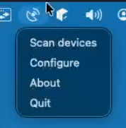
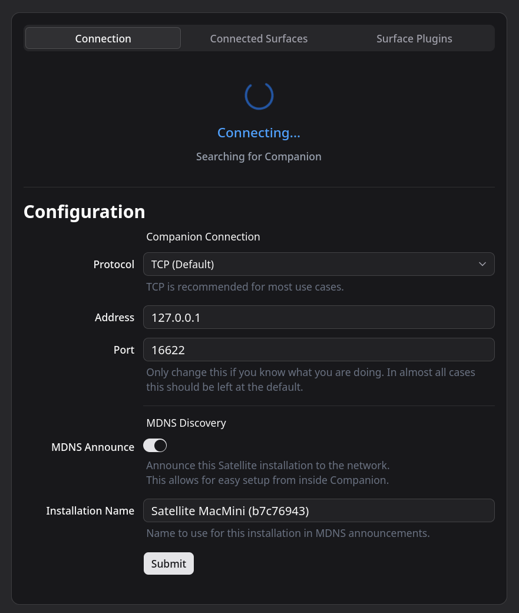
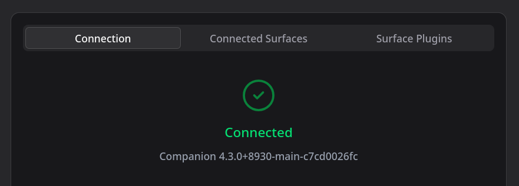
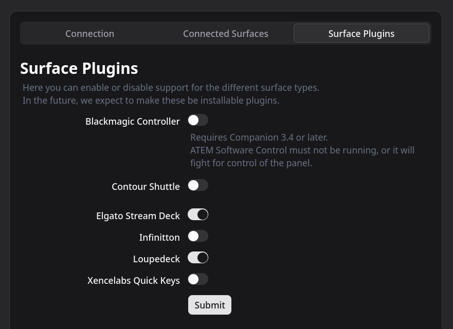
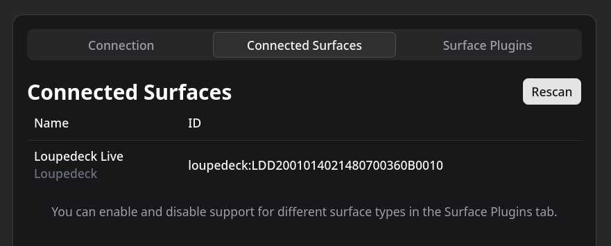

# Getting Started with Companion Satellite

This guide walks you through setting up Companion Satellite to connect your local surfaces to a remote Companion server.

:::danger Security Notice
Do not expose Companion's TCP ports directly to the internet. Satellite should always connect over a trusted private network or VPN — not via a publicly accessible IP address or port-forwarded router.
:::

## Before You Open Satellite

Before launching Companion Satellite, complete the following steps:

- Connect the Stream Deck or other surfaces that you want to use.
- Close the Elgato Stream Deck app. Companion Satellite will not detect your device if the Elgato Stream Deck app is open.
- Close the application for any other surface types you wish to use.

:::info
Companion 3.4.0 or newer is required to use Satellite.
:::

## Start the Program

Open the program. You will see it launch into your system tray area:

- **macOS users:** top right of your screen
- **Windows users:** bottom right of your screen

## Configure Satellite

To connect the Satellite surface to your Companion setup, you need to configure the connection.

### Step 1: Open the Context Menu

Right-click on the Companion Satellite icon in the system tray.

:::tip Headless Machines
If you are running Companion Satellite on a headless machine, such as a Raspberry Pi, you can instead navigate to `http://<satellite-ip>:9999` and access the same configuration interface.
:::

### Step 2: Open the Configure Window

Choose "Configure" in the context menu. This will open a new window:

### Step 3: Enter the Companion Server Address

Type in the IP Address or hostname of the remote Companion server into the Address field, and click **Save** at the bottom.

:::note
In most cases you **should not** change the port number from the default.
:::

### Step 4: Verify Connection

Shortly after you have clicked Save, the top section should update to confirm that it has connected:

### Step 5: Enable Surface Plugins

Switch to the "Surface Plugins" tab and make sure that the surface types you wish to use are all enabled:

### Step 6: Confirm Connected Surfaces

Finally, confirm in the "Connected Surfaces" tab that Satellite has correctly detected each surface:

You will also be able to see your surfaces in Companion, where they will appear just like other surfaces, but with the IP address of the Satellite machine under the "Location" column.

## Disconnected State

While Satellite is in the disconnected state, your surfaces will show a placeholder card to indicate this:

## Scan for Surfaces

If you disconnect, reconnect, or add new Satellite surfaces on the local machine, Satellite should automatically detect the surfaces as they are attached.

If for some reason it does not detect a surface by itself, you can trigger a rescan from either the tray icon or from the configuration page.

<!-- TODO: Add scan.png screenshot when available -->

Surfaces will then be detected as normal and appear in the "Connected Surfaces" tab and in Companion.
